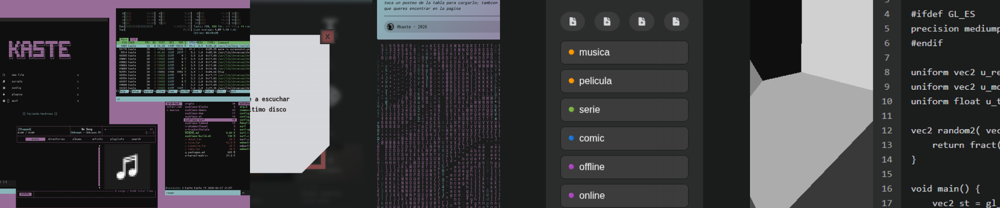

# octantes

Check out my website! [octantes](https://octantes.github.io/) is a multimedia portal where you can see how I weave my spells and write about them. You might find it's [repo](https://github.com/octantes/octantes.github.io) interesting for a GH Page setup, a custom SPA + SSG blend with hidration built on vue. The system recieves markdown files and creates html that is then pulled by the router into a vue component.

Also, you can find my [arch-hud](https://github.com/octantes/arch-hud) setup here - a minimal (suckless based) suite of tools, configs and scripts for arch linux (still WIP).

  

## projects

I like to build small, fully local tools that use the browser's native APIS and features to reduce dependancy complexity and allow for privacy while still providing a good interface and experience. Some of them are uploaded here, distributed as plain html files, and some I've yet to upload.

- [trackwithslate](https://github.com/octantes/trackwithslate) is a tiny and local csv based tabular data managment and tracking tool
- [shadewithseal](https://github.com/octantes/shadewithseal) is a tiny and local glsl shader playground for webgl with indexed storage
- [browsewithscroll](https://github.com/octantes/browsewithscroll) is a tiny and local media and font preview tool based around scrolling

## WIP

- [blackbook](https://github.com/octantes/blackbook) is an upcoming project that combines multiple of these local tools in an infinite canvas ui connecting md, csv and json
